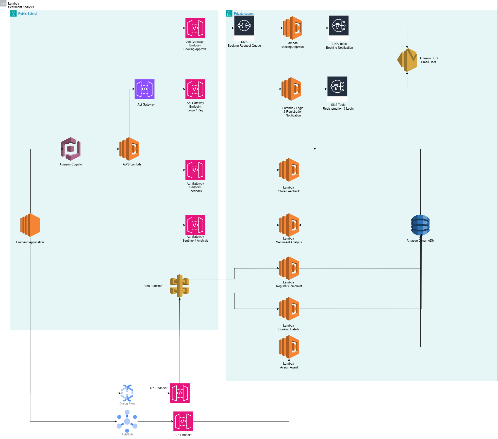

# DalVacationHome

DalVacationHome is a serverless, multi-cloud application designed to manage vacation home bookings efficiently. The application utilizes backend-as-a-service (BaaS) technologies and provides customizable features, including a virtual assistant, secure multi-factor authentication, and message passing capabilities for seamless user interactions.

## Technology

- **Cloud Providers**: AWS, GCP
- **Frontend**: React.js CRA, Material UI
- **Serverless Backend**: AWS Lambda, AWS Cognito, AWS SNS, AWS SQS, AWS Lex, GCP Pub/Sub, GCP Cloud Function, Google Natural Language API, WebSocket API
- **Storage**: AWS DynamoDB, Amazon S3
- **Deployment**: GCP Cloud Run
- **Infrastructure-as-Code**: AWS CloudFormation
- **Data Visualization**: Looker Studio Dashboard

## Features

- **User Management & Authentication**: Secure sign-up and multi-factor authentication using AWS Cognito, DynamoDB, and AWS Lambda.
- **Virtual Assistant**: Provides real-time assistance with AWS Lex, offering navigation support and booking information retrieval.
- **Booking and Feedback**: Allows registered users to book rooms, view availability, provide feedback, and manage reservations.
- **Message Passing**: Facilitates communication between customers and property agents through GCP Pub/Sub, with logging in DynamoDB or Firestore.
- **Notifications**: Real-time notifications for registration, login, and booking processes using AWS SNS and SQS.
- **Data Analysis & Visualization**: Sentiment analysis of customer feedback using Google Natural Language API, and admin dashboards for property agents with Looker Studio.
- **Multi-Cloud Deployment**: Utilizes GCP Cloud Run for hosting, with service automation via CloudFormation and GCP Cloud Deployment Manager.

## Architecture

